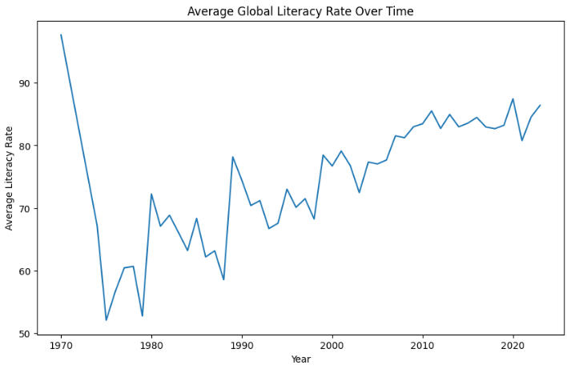
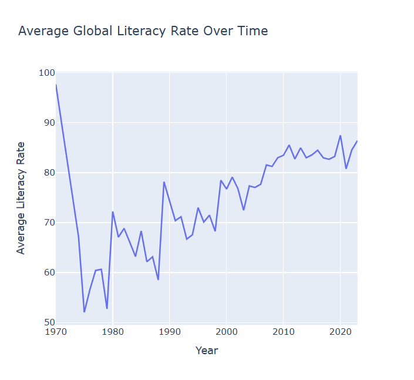
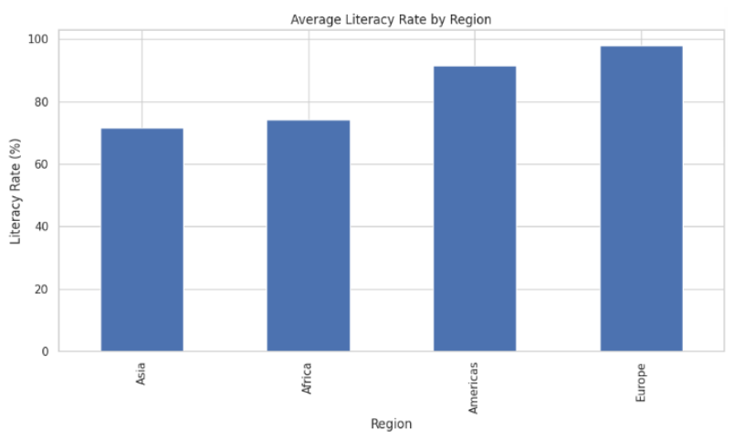
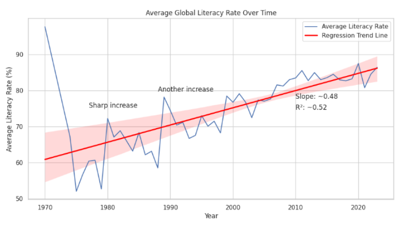

# Week 11 Learning Log: Settling on Data Sources and Acquiring Data

Name: Amelia Pucek

Date: 04/17/2026

Course: CS-215

---

## Dataset Selection

For this project, I decided to work with a global literacy rates dataset from Our World in Data. I chose this dataset because it provides literacy rate information across countries and years, making it useful for analyzing long-term global education trends and differences between countries.

The dataset includes country names, country codes, years, and literacy rates among adults.

---

## Acquiring the Dataset

I successfully obtained the dataset as a CSV file from Our World in Data and imported it into a Google Colab notebook using pandas. After importing the dataset, I performed initial exploratory analysis to better understand its structure and identify potential cleaning issues.

---

## Strengths and Limitations

One strength of this dataset is that it contains literacy information across many countries and years, allowing for broad comparisons and trend analysis.

However, there are several limitations that need to be considered:
- Some country codes are missing
- Coverage is uneven across countries and years
- Literacy may be measured differently across countries

This dataset is useful for identifying large-scale trends and patterns, but it should not be used to make strong causal claims about education systems or policy effectiveness.

---

## Dataset Provenance and Considerations

This dataset was published by Our World in Data and appears to compile literacy statistics from international organizations and national reporting sources. Because the data comes from multiple countries and years, collection methods may differ across observations.

The dataset likely represents a sample of available literacy measurements rather than a perfectly complete global record. Some countries and years are represented more heavily than others, which may affect comparisons and trend analysis.

This is important to consider when interpreting the data, since differences in methodology or reporting standards could influence literacy estimates.

---

## Preliminary Analysis

During exploratory analysis, I found that the dataset contains 1,725 rows and 4 columns. Literacy rates range from 9% to 100%, showing significant variation across countries and years.

I also found that the Code column contains many missing values, while the other columns are mostly complete. No duplicate rows were detected in the dataset.

---

## Initial Visualization

The graph shows a general increase in average literacy rates over time. This suggests that literacy has improved globally across recent decades, although differences in country coverage across years may affect the averages.

---

## Data Cleaning and Wrangling

So far, I have:
- Imported the dataset into Python using pandas
- Checked for missing values
- Verified there are no duplicate rows
- Explored summary statistics and dataset structure

Future cleaning and wrangling steps may include:
- Handling missing country codes
- Checking for inconsistencies in country names
- Preparing the data for additional visualizations and analysis

---

## Challenges and Roadblocks

One challenge is understanding how literacy data was collected across different countries and years, since measurement methods may vary.

Another challenge is handling incomplete country code information and ensuring consistent comparisons across time periods.

---

## Google Colab Notebook

[Click to go to my Google Colab](https://colab.research.google.com/drive/126I5cjCoF5vQQR2Rh44y-D0dL90q7FAX?usp=sharing)

---

# Week 12 Update: Exploratory Analysis and Visualization

Name: Amelia Pucek

Date: 04/24/2026

Course: CS-215

---

## Goal

This week, I continued exploring my global literacy rates dataset by performing exploratory analysis and creating interactive visualizations using Plotly.

The goal of this analysis is to better understand literacy trends across countries and over time.

---

## Exploratory Analysis and Visualization

This week, I continued exploring my global literacy rates dataset by performing exploratory analysis and creating interactive visualizations using Plotly.

The dataset contains literacy rate information across countries and years. During exploration, I confirmed that the dataset contains four columns:
- Entity
- Code
- Year
- Literacy rate among adults

The dataset appears relatively clean overall, although the Code column contains missing values for some entries.

---

## Interactive Visualization

For this week’s analysis, I created an interactive Plotly visualization showing average global literacy rates over time.

The visualization reveals a general upward trend in literacy rates across recent decades, suggesting that literacy has improved globally over time.

One important limitation is that the dataset may not include the same countries every year, which could influence yearly averages and trends.

Because the visualization was created with Plotly, it allows users to interact with the graph and explore changes across years more easily.

---

## NOTE

Because this webpage is done in README, the interactive map won't work here. However, I did add it at the bottom of this webpage in this section: *Interactive Plotly Visualization and Notebook*.

---

## What I Learned From the Analysis

From this exploratory analysis, I learned that:
- Global literacy rates generally increase over time
- Literacy levels vary significantly across countries and years
- The dataset is relatively clean and workable for future analysis
- Missing country code values may require additional cleaning later

This analysis helped me better understand the structure of the dataset and identify potential directions for deeper analysis and visualization.

---

## Interactive Plotly Visualization and Notebook

[Click to Access Interactive Graph](https://colab.research.google.com/drive/126I5cjCoF5vQQR2Rh44y-D0dL90q7FAX#scrollTo=hG6zr4EsPGwe&fullscreenOutput=true)

[Click to Access Colab Notebook](https://colab.research.google.com/drive/126I5cjCoF5vQQR2Rh44y-D0dL90q7FAX?usp=sharing)

---

# Week 14 Update: Project Update & New Technique

Name: Amelia Pucek

Date: 04/24/2026

Course: CS-215

---

## Project Progress Update

So far, I have completed about half of the core analysis and visualizations for my global literacy rates project.

At this stage, I have:
- Analyzed overall global literacy trends over time
- Created visualizations comparing literacy rates across regions
- Explored literacy differences between countries
- Performed regression analysis to examine long-term trends
- Written interpretations and explanations for most visualizations
- Created the overall structure and narrative for my project webpage

I still plan to finalize and refine:
- The top 10 country comparison sections
- The literacy improvement analysis section
- Minor formatting and organization improvements across the webpage

Overall, the project structure and major analysis components are complete, and I am currently focused on polishing and refining the final presentation.

---

## Literacy Rates by Region

The chart above shows clear differences in average literacy rates across regions.

Europe has the highest average literacy rate at about 98%, while the Americas also show relatively high levels at around 92%.

Asia and Africa have lower averages, at roughly 72% and 74% respectively. While these two regions are fairly close to each other, both remain significantly below Europe and the Americas.

Overall, the pattern highlights global inequality in education outcomes, likely shaped by differences in economic development, access to schooling, and long-term investment in education systems.

---

## New Technique Researched and Implemented

The new technique I researched and implemented for this project was linear regression analysis using the SciPy library.

The positive slope (0.48) shows that global literacy rates have generally increase over time. On average, literacy has risen by about 0.48 percentage points per year.

The R² value of 0.52 suggests that time explains about half of the variation in literacy rates. This means that there is a clear upward trend overall, but it's not perfectly consistent. Other factors that may influence these results are differences between countries, gaps in data reporting, and regional inequality.

---

## Why Regression?

I used regression analysis to measure the overall trend in global literacy rates over time and calculate the average yearly increase in literacy rates.

To learn this technique, I used:
- SciPy documentation for `linregress`
- Web articles explaining regression analysis concepts
- ChatGPT for troubleshooting coding and interpretation questions
- Google Gemini in Google Colab for debugging assistance

Using regression analysis helped move the project beyond simple visualization by providing quantitative evidence for the upward trend in global literacy rates.

---

## Communication Strategy

My project is organized as a narrative that moves from broad global patterns to more specific country and regional comparisons.

I begin with an overview of global literacy trends over time before moving into:
- comparisons between regions,
- highest and lowest literacy rate countries,
- and countries with the largest literacy improvements.

The visuals are sequenced to gradually build a clearer understanding of global literacy inequality and progress over time.

For presenting the project, I plan to primarily present directly from my project webpage because it already organizes the visualizations and written explanations into a clear narrative structure.